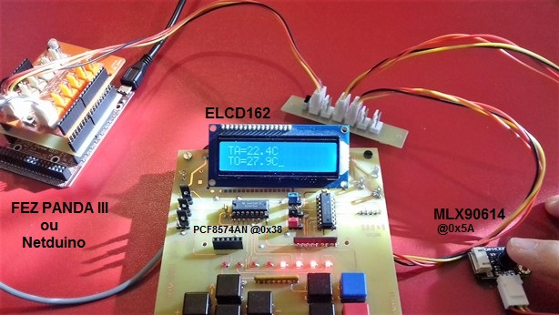

# MLX90614

<strong>Description</strong>
-------------------------------------
Source code.

A <strong>.NETMF v4.3 class</strong> write for a MLX90614 circuit : <strong>IR Temperature sensor</strong>. 

This class is also in the <a href="https://www.nuget.org/packages/WEBGE.Microtoolskit/" target="_blank">MicroToolsKit</a> <strong>library</strong>. Download at <a href="https://www.nuget.org" target="_blank">nuget.com</a>

 

<strong>Hardware</strong>
---------------------
<strong> Targets </strong>: Netduino, Netduino2 plus, Netduino 3, FEZ PANDA 3 et COBRA 3.

<strong>Software</strong>
---------------------
<ul>
<li><strong>Language</strong> : C#</li>
<li><strong>Framework used</strong> : .NETMF 4.3</li>
<li><strong>IDE</strong> : Visual Studio Community 2013 (2015)</li>
<li><strong>xml</strong> : documentation inside class </li> 
<li><strong>Exception</strong> : if transaction failed</li>
</ul>

<strong> Visual Studio solution</strong>
-------------------------------------
<ul>
<li><strong>MLX90614</strong>
<ul>
<li><strong>MLX90614</strong> : .NetMF class</li>

<li><strong>Netduino</strong> : class test program for Netduino board</li>
<li><strong>FezPanda</strong> : class test program for Fez Panda board</li>
</ul>
</li>
</ul>

<strong>Assembly</strong>
--------------------------

<strong>Video</strong>
-------------------
<a href="https://youtu.be/3xB3awM5VO8" target="_blank">To see on Youtube</a>

<strong>Keywords</strong>
----------------------------
I²C Bus, Netduino, FEZ, PANDA, COBRA, C#, NETMF, Visual Studio.

<strong>Tested on</strong>
-------------------
Fez Panda III, Netduino2 plus

<strong>Todo list</strong>
-------------------
write in EEPROM

<strong>To get started<strong>
--------------------
- <a href="https://webge.github.io/MLX90614/" target="_blank">MLX90614 GitHub Page</a> (in French).

<strong>Wiki</strong>
--------------------
- <a href="https://csharpembarquenetduino.wikispaces.com/Home" target="_blank">Netduino et FEZ</a> (in French).

<strong>News feed on Google+</strong>
--------------------
- <a href="https://plus.google.com/collection/oaaJX" target="_blank">Netduino et FEZ</a> (in French).

<strong>Project site</strong>
--------------------
- <a href ="http://webge.dyndns-server.com/dokuwiki/doku.php?id=netmf43:microtoolskit">MicroToolsKit library</a> (in English).

<strong>Maintened by<strong> <a href="mailto:philippemariano@gmail.com">WebGE</a>
